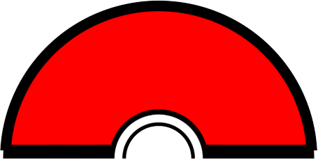
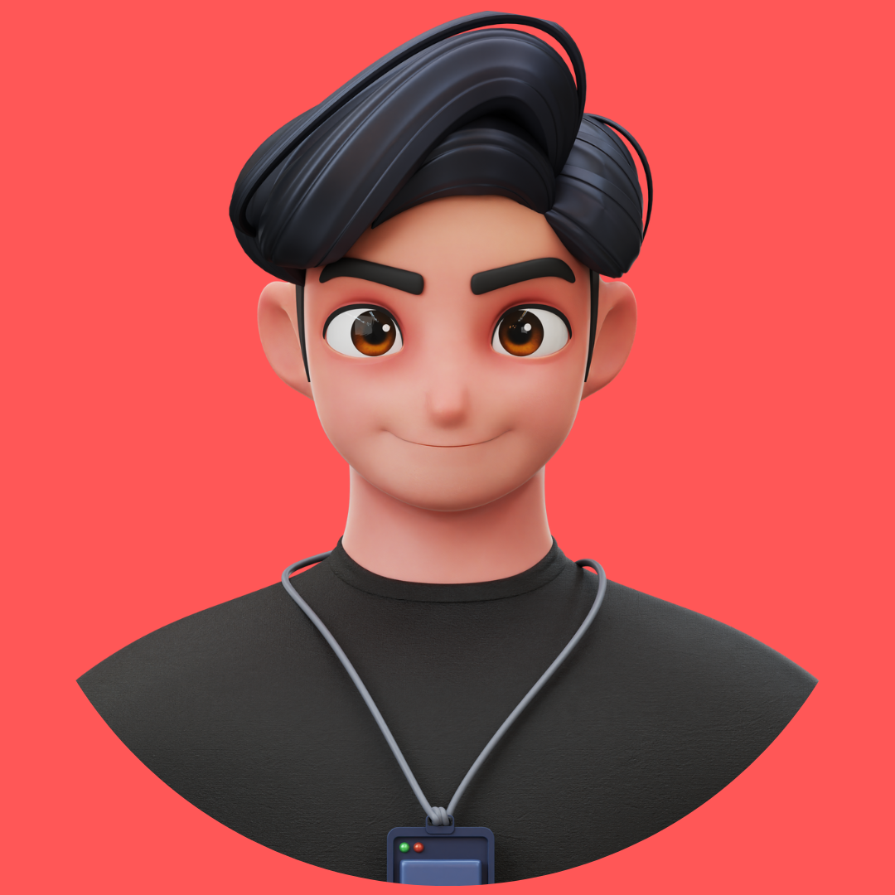

<div align="center">

<br>
<br>
<h1> Hello Fellow < Developers/ >!  </h1>

<br>
<br>

<details>
<summary>Open profile</summary>
<br>
<div>
  <div align=center>
      
  </div>
  <div align=center>
      <a href="https://git.io/typing-svg"></a>
  </div>
</div>

<details>
<summary>About me</summary>

[//]: # "You must have a lf before the markdown element when inside a block for it to work: https://stackoverflow.com/questions/29368902/how-can-i-wrap-my-markdown-in-an-html-div"

<div align="left">

```js
/**
 * Represents me.
 * @constructor
 * @param {string} city - Islamabad, Pakistan.
 * @param {string} languagues - English, French, German & Spanish
 * @param {string} jobTitle - Full Stack Engineer, UX/UI Designer
 * @param {string} specialization - Building full-fledged web applications.
 * @param {string} interests - AI, writing & problem-solving.
 * @param {string} hobbies -  Reading & Watching Sci-Fic Movies.
 * @param {string} approachable - Yes, to collaborate on exciting projects, don't hesitate to react out.
 * @param {string} stength - Resolute.
 * @param {string} weakness - Shyness.
 * @throws {Punch} To any and all bugs.
 */
```

</div>

</details>

<details>
<summary>Tools</summary>
<div>
  <p style="display: inline-block;" align="center">
    <kbd>
      <kbd>Programming Languages</kbd>
      <br>
      <br>
       
       
       
       
    </kbd>
    <kbd>
      <kbd>Back-end</kbd>
      <br>
      <br>
      
      
      
      
    </kbd>
     <kbd>
      <kbd>Mobile</kbd>
      <br>
      <br>
      
      
      
      
    </kbd>
    <kbd>
      <kbd>Front-end</kbd>
      <br>
      <br>
       
       
       
      
      
      
      
      
    </kbd>
    <kbd>
      <kbd>Database</kbd>
      <br>
      <br>
      
      
      
    </kbd>
    <br>
    <br>
    <kbd>
      <kbd>Data Science & AI</kbd>
      <br>
      <br>
      
      
      
    </kbd>
    <kbd>
      <kbd>System, Networking & Deployment</kbd>
      <br>
      <br>
      
      
      
      
      
    </kbd>
    <kbd>
      <kbd>Terminal Scripts</kbd>
      <br>
      <br>
      
          
    </kbd>
    <kbd>
      <kbd>Tools</kbd>
      <br>
      <br>
      
      
      
      
      
      
  </kbd>
     <kbd>
      <kbd>Game Development</kbd>
      <br>
      <br>
      
    </kbd>
  </p>
</div>
</details>

<details>
  <summary>Quote</summary>
  <br>
  One of my favourite quotes
  <blockquote>
    “Can I say something? Um, I’m the type of person that if you ask me a question and I don’t know the answer, I’m gonna tell you that I don’t know. But I bet you what, I know how to find the answer and I will find the answer.”
    <br><strong>Chris Gardner interpreted by Will Smith in the movie "Pursuit of Happyness" (2006)</strong>
  </blockquote>
</details>

<details>
  <summary>Free DOSE hit</summary>
  <br>
  <small><i>DOSE (dopamine, oxytocin, serotonin & endorphin), refresh page if dose was ineffective.</i></small>
  <br>
  <div align="center"></div>
</details>

<details>
<summary>What can I do for you?</summary>
<table style="border: none">
  <tr>
  <td width="50%" valign="top">

[//]: # "Fighting against markdown and blocks isn't easy, indentation is catastrophic"

## Let's Work on Your Project Together!

If you have any questions about web development, writing mistake-free documentation or AI, feel free to <a href="mailto:sufiyanrazaofficial@gmail.com">contact me by email</a>, I won't bite, I promise.

  </td>
  <td width="50%" valign="top">

## It's not perfect, isn't it?

**<a href="https://github.com/Sufi-Yan-Raza/Sufi-Yan-Raza/issues"></a>
**

<blockquote>“I think it’s very important to have a feedback loop, where you’re constantly thinking about what you’ve done and how you could be doing it better.”
<br><strong>– Elon Musk</strong></blockquote>

  </td>
  </tr>
</table>
</details>

</details>


</div>
<br/>
<br/>
<div align=left+>
<h2> Connect with me  </h2>
<a href = 'https://api.whatsapp.com/send?phone=923000192168'> </a> 

</div>
